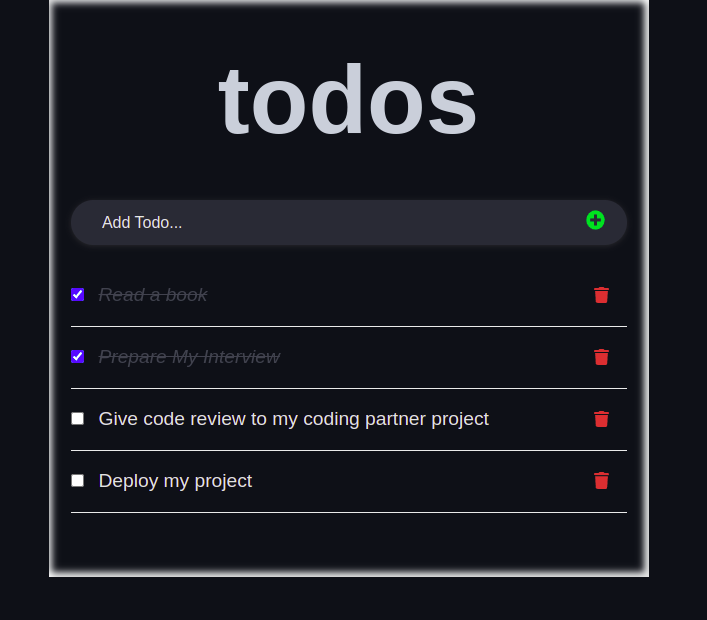

# Todo App

## Description

This project has been bootstrapped with [Create React App](https://github.com/facebook/create-react-app).



> "To-do list" is a tool that helps to organize your day. It simply lists the things that you need to do and allows you to mark them as complete. 

## Built With

- 
- 
- 
- 

## Get Started

To get a local copy up and running follow  s these simple example steps.

1. Download the Zip file or clone the repo with ```git clone https://github.com/tresorsawasawa/Todo_List_App.git ```.
2. ``` cd /Todo_List_App ```
3. ``` npm install ``` To install all the dependencies.
4.  ``` npm start ``` To open in your browser

## Test

For tracking linter errors locally you need to follow these steps:

- After cloning the project make sure you have run this command

  > `npm install` command

- For tracking the linter errors in HTML file run:

  > `npx hint .`

- For tracking the linterj errors in CSS file run:

  > `npx stylelint "\*_/_.{css,scss}"`

- And For tracking the linter errors in JavaScript file run:

  > `npx eslint .`

- Use `npm run build` to run the app in live server
## Live Demo

See the [Live](https://tresorsawasawa.github.io/react-todo-app/)

## Authors

👤 **@Tresorsawasawa**

- GitHub: [@tresorsawasawa](https://github.com/tresorsawasawa)
- Twitter: [@tresorsawasawa](https://twitter.com/TresorSawasawa)
- LinkedIn: [Trésor Sawasawa](https://www.linkedin.com/in/tr%C3%A9sor-sawasawa-43745320b/)
## 🤝 Contributing

Contributions, issues, and feature requests are welcome!

Feel free to check the [issues page](../../issues/).

## Show your support

Give a ⭐️ if you like this project!

## Acknowledgments

- Thanks to everyone who will get time to check this code and sugest any [issue](https://github.com/tresorsawasawa/MyPortfolio/issues) to improve the page.
- Thank you [Microverse](https://www.microverse.org/)
- Thank you [ibaslogic](https://ibaslogic.com/react-tutorial-for-beginners/) for a good Documentation.

## 📝 License

This project is [MIT](./MIT.md) licensed.
